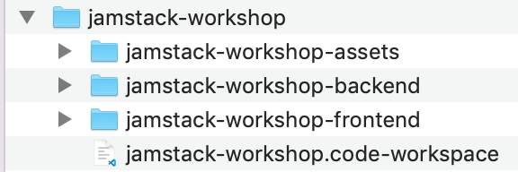
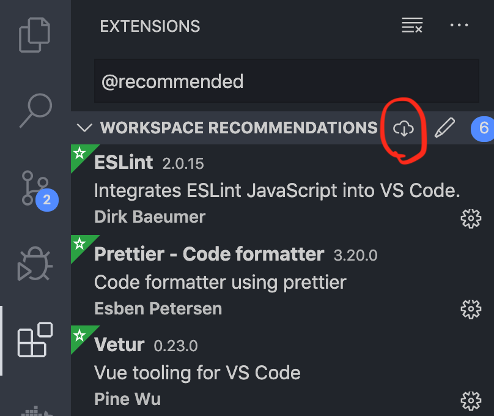

# Jamstack workshop


👋 Ready for some jam? Follow these steps to start.

## Install some stuff

1. Node.js: [download](https://nodejs.org/en/download)

Hope you have [github](https://github.com/) account and [git bash](https://git-scm.com/downloads) installed 🤔

## Configure workspace

1. Fork [jamstack-workshop-frontend](https://github.com/souljorje/jamstack-workshop-frontend) & [jamstack-workshop-backend](https://github.com/souljorje/jamstack-workshop-backend)
2. Create folder for the project (name it `jamstack-workshop` for instance)

   ```sh
   mkdir jamstack-workshop
   cd jamstack-workshop
   ```

3. Clone this repo and forked jamstack-workshop-frontend & jamstack-workshop-backend repos to to created folder.

   ```sh
   git clone https://github.com/souljorje/jamstack-workshop-assets.git
   git clone https://github.com/souljorje/jamstack-workshop-frontend.git
   git clone https://github.com/souljorje/jamstack-workshop-backend.git
   ```

4. _Only for VSCode users._ Copy `jamstack-workshop.code-workspace` to created folder.\
   Folder structure must be:\
   
5. _Only for VSCode users._ Open copied `jamstack-workshop.code-workspace` with VSCode
6. _Only for VSCode users._ Install recommended extensions:\
   
7. Install dependencies in jamstack-workshop-frontend & jamstack-workshop-backend (see commands in README there)
8. Deal with database (see README in jamstack-workshop-backend)
9. You are ready 👏

## List of APIs

1. Chuck Norris jokes: [http://www.icndb.com/api](http://www.icndb.com/api)
   Usage: [https://api.icndb.com/jokes/random/50](https://api.icndb.com/jokes/random/50)

2. Just dummy data: [https://jsonplaceholder.typicode.com](https://jsonplaceholder.typicode.com/)
   Usage: [https://jsonplaceholder.typicode.com/posts](https://jsonplaceholder.typicode.com/posts)
