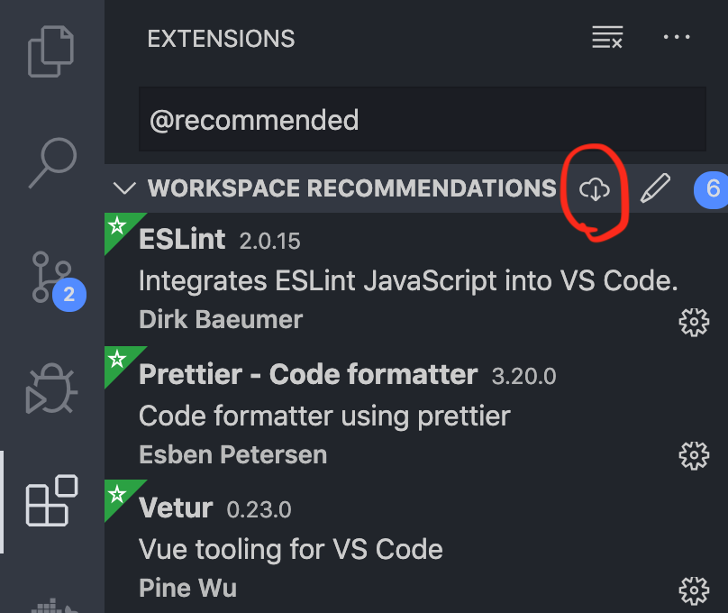

# 👋 Ready for some jam?

## Install some stuff

1. Node.js: [download](https://nodejs.org/en/download)
2. Yarn: [download](https://classic.yarnpkg.com/en/docs/install)
3. MongoDB: [linux](https://docs.mongodb.com/manual/administration/install-on-linux/), [macOS](https://docs.mongodb.com/manual/tutorial/install-mongodb-on-os-x/), [windows](https://docs.mongodb.com/manual/tutorial/install-mongodb-on-windows/)
4. Run mongoDB: [macOS](https://docs.mongodb.com/manual/tutorial/install-mongodb-on-os-x/#run-mongodb-community-edition), [windows](https://docs.mongodb.com/manual/tutorial/install-mongodb-on-windows/#run-mongodb-community-edition-as-a-windows-service)

## Configure workspace

1. Fork [jamstack-workshop-frontend](https://github.com/souljorje/jamstack-workshop-frontend) & [jamstack-workshop-backend](https://github.com/souljorje/jamstack-workshop-backend)
2. Create folder for the project (name it `jamstack-workshop` for instance)
3. Clone this repo and forked jamstack-workshop-frontend & jamstack-workshop-backend repos to to created folder
4. _Only for VSCode users._ Copy `jamstack.code-workspace` to created folder
5. _Only for VSCode users._ Open copied `jamstack.code-workspace` with VSCode
6. _Only for VSCode users._ Install recommended extensions:\
   
7. Install dependencies in backend & frontend by running: `yarn`
8. You are ready 👏
